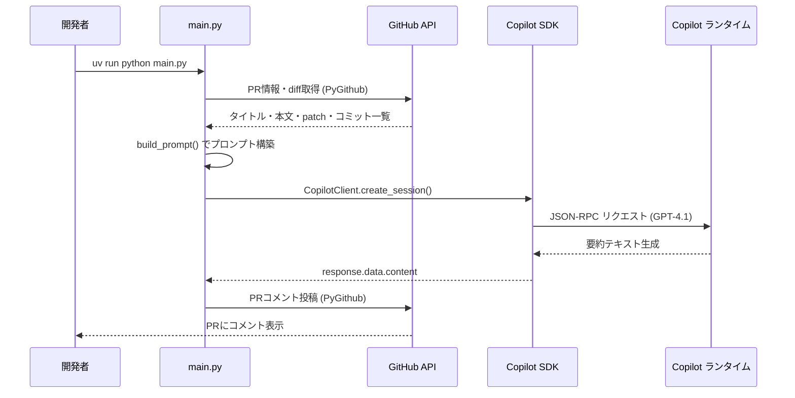
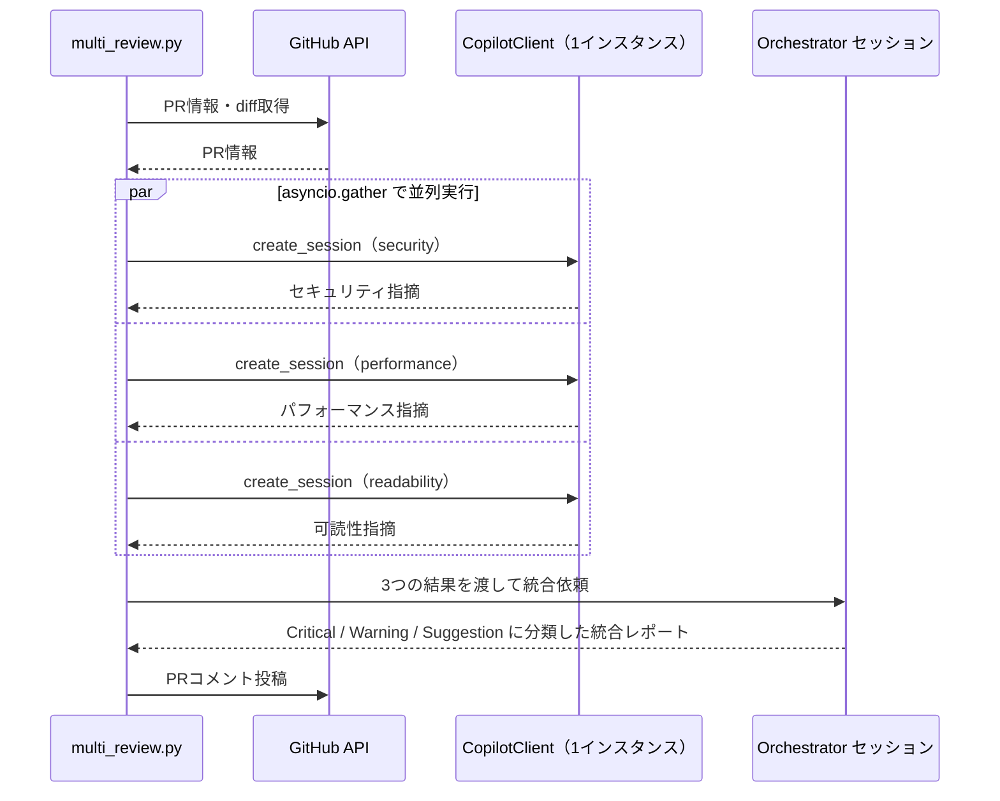

# GitHub Copilot SDKでPR要約botを作る

## はじめに

こんにちは。Sreake事業部アプリケーション開発支援チームの[太田暢](https://ota1022.github.io/)です。

普段はバックエンドを中心にアプリケーション開発を担当しており、社内のAI駆動開発検証チームでツールの検証やガイドライン策定も行っています。

2026年1月14日にGitHub Copilot SDKが[technical preview](https://github.blog/changelog/2026-01-14-copilot-sdk-in-technical-preview/)として公開されました。
AIエージェントを使った開発が活発化している一方、業務上の制約でプラットフォームやモデルの選択肢が限られるチームも多いと思います。GitHub Copilot経由でエージェントを動かせれば、そういった制約下でも恩恵を受けやすくなります。
この記事では、Copilot SDKを使った2種類のPRレビューbotを実装します。

1. **PR要約bot**（`main.py`）：PRのdiffを読んで変更内容・レビューポイントを自動コメント
2. **マルチエージェントレビューbot**（`multi_review.py`）：セキュリティ・パフォーマンス・可読性の3エージェントが並列でレビューし、結果をまとめて投稿

対象読者は次のような方です。

- AIエージェント開発を触ってみたいソフトウェアエンジニア
- GitHub上のレビュー体験を改善したいチーム
- GitHub Copilot SDKの実践的な使い方を知りたい方

## 1. GitHub Copilot SDKとは

GitHub Copilot SDKは、Copilot CLIで使われているエージェント実行基盤を、アプリケーションコードから扱えるSDKです。  
2026年1月にTechnical Previewとして公開され、2026年2月現在ではNode.js / Python / Go / .NET向けの実装が提供されています。
実装や最新情報は、[GitHub公式リポジトリ](https://github.com/github/copilot-sdk)で確認できます。

### 1.1 何ができるのか

Copilot SDKで扱える代表的な機能は次のとおりです。

- ファイル操作、Git操作、Webリクエストなどの標準ツール
- 独自ツール/スキル定義による振る舞いの拡張
- MCP（Model Context Protocol）サーバー連携
- 用途に応じたモデル切り替え（マルチモデルルーティング）

内部的にはアプリケーションからSDKを通してCopilotランタイムにJSON-RPCでリクエストし、ツール実行や推論結果を受け取っています。

### 1.2 前提条件

本記事の実行環境は以下を想定しています。

- GitHub Copilotサブスクリプション（Individual / Business / Enterprise のいずれか）
- Python 3.12以上
- uv（パッケージマネージャ）
- 対象リポジトリにPRを作成・コメント投稿できる権限

本記事の執筆時点ではTechnical Preview段階のため、API・認証方法・パッケージ仕様が変更される可能性があります。  
運用導入前に、必ず最新の公式ドキュメントを確認してください。

## 2. 環境構築

### 2.1 Copilot CLI のインストール

Copilot SDK は**単体では動作しません**。内部でCopilot CLIをサーバーモードで起動し、JSON-RPCで通信する仕組みのため、SDKとは別にCopilot CLIのインストールが必要です。

```bash
# GitHub CLI をインストール（未インストールの場合、macOS）
brew install gh

# GitHub CLI で認証（ブラウザが開く）
gh auth login

# Copilot CLI 拡張をインストール
gh extension install github/gh-copilot
```

Copilot CLI はTechnical Preview段階のためインストール方法が変更される可能性があります。最新情報は[公式リポジトリ](https://github.com/github/copilot-sdk)を確認してください。

### 2.2 Pythonプロジェクトのセットアップ

```bash
# 0) uv インストール（macOS）
# brew install uv

# 1) プロジェクトを作成
uv init --python 3.12 pr-summary-bot
cd pr-summary-bot

# 2) 依存を追加
uv add github-copilot-sdk PyGithub
```

必要な環境変数は次の3つです。

- `GITHUB_TOKEN`: PR情報の取得とコメント投稿に使うトークン
- `GITHUB_REPOSITORY`: `owner/repo` 形式
- `PR_NUMBER`: 対象PR番号

`uv run` で実行します。

```bash
GITHUB_TOKEN=xxx \
GITHUB_REPOSITORY=owner/repo \
PR_NUMBER=123 \
uv run python main.py
```

## 3. PR要約botの設計

全体フローは次のとおりです。



エージェントに渡す入力は次の3種類です。

- PRタイトル・本文
- 変更ファイル一覧と差分（patch）
- コミットメッセージ一覧

出力は次の4項目に固定します。

- 変更内容の要約（日本語）
- 変更カテゴリ（機能追加 / バグ修正 / リファクタ など）
- レビューポイント（確認すべきポイント）
- 影響範囲（機能、運用、性能、セキュリティなど）

## 4. 実装

### 4.1 PRのdiffを取得する

`PyGithub` でPR情報を取得します。  
ファイル数や差分が大きいPRではトークン消費が急増するので注意してください。

対策として今回は次を実装しておきます。

- ファイルごとのpatchを一定文字数で切り詰める（`MAX_PATCH_CHARS_PER_FILE = 3000`）
- patchの有無にかかわらず `file_info` 全体のシリアライズサイズで合計を計算し、上限（`MAX_TOTAL_PATCH_CHARS = 50000`）を超えた時点で以降のファイルを打ち切る

### 4.2 プロンプトを組み立てる

`build_prompt` でPR情報をプロンプトに変換します。出力フォーマットをプロンプト内に明示することで、モデルの出力を安定させます。

```python
def build_prompt(pr_info: dict) -> str:
    files_summary = json.dumps(pr_info["files"], ensure_ascii=False, indent=2)
    commits_text = "\n".join(f"- {msg}" for msg in pr_info["commits"])

    return f"""以下のPull Requestの内容を分析し、日本語で要約してください。

## PR情報
- タイトル: {pr_info["title"]}
- 作成者: {pr_info["author"]}
- ブランチ: {pr_info["head"]} → {pr_info["base"]}

## PR説明文
{pr_info["body"]}

## コミット一覧
{commits_text}

## 変更ファイル
{files_summary}

---

以下のフォーマットで出力してください（Markdown形式）:

## 📝 変更内容の要約
（変更全体を2〜3文で簡潔に説明）

## 🏷️ 変更カテゴリ
（機能追加 / バグ修正 / リファクタリング / ドキュメント / テスト / 設定変更 / 依存関係更新）

## 👀 レビューポイント
（レビュアーが特に注目すべき箇所を箇条書きで）

## 📐 影響範囲
（この変更が影響する範囲を簡潔に）
"""
```

### 4.3 Copilot SDKでエージェントを構築する

```python
import asyncio
import json
import os
import sys
from copilot import CopilotClient
from github import Github

MAX_PATCH_CHARS_PER_FILE = 3000
MAX_TOTAL_PATCH_CHARS = 50000

SYSTEM_MESSAGE = """\
あなたはコードレビュー支援エージェントです。
Pull Requestの差分を読み取り、変更内容を正確かつ簡潔に要約します。
技術的に正確で、レビュアーの意思決定に役立つ情報を提供してください。
出力は必ず日本語のMarkdown形式で行ってください。
"""

async def generate_summary(pr_info: dict) -> str:
    prompt = build_prompt(pr_info)
    async with CopilotClient() as client:
        session = await client.create_session(
            {
                "model": "gpt-4.1",
                "system_message": {"mode": "replace", "content": SYSTEM_MESSAGE},
                # available_tools は組み込みツール（ファイル操作・Git操作等）の許可リスト。
                # PR要約では不要なため空リストを渡して無効化する。
                "available_tools": [],
            }
        )
        response = await session.send_and_wait({"prompt": prompt}, timeout=120.0)
        await session.destroy()
    return response.data.content

async def main() -> None:
    github_token = os.environ["GITHUB_TOKEN"]
    repo_name = os.environ["GITHUB_REPOSITORY"]
    pr_number = int(os.environ["PR_NUMBER"])

    gh = Github(github_token)
    pr_info = get_pr_info(gh, repo_name, pr_number)
    summary = await generate_summary(pr_info)
    post_comment(gh, repo_name, pr_number, summary)

if __name__ == "__main__":
    asyncio.run(main())
```

実装上の補足です。

- `system_message` の `"mode": "replace"` はCopilotのデフォルトシステムプロンプトを完全に置き換えます。安全寄りに設定したい場合は `"mode": "append"` を使うと既存のシステムプロンプトに追記する形になります。
- `available_tools: []` は**組み込みツール**（ファイル操作・Git操作など）の許可リスト。カスタムツールを定義する場合は別途 `tools` パラメータを使います。PR要約では外部ツール実行が不要なため空リストを渡しています。
- diffを `MAX_PATCH_CHARS_PER_FILE` / `MAX_TOTAL_PATCH_CHARS` で制限してトークン消費を抑えます。
- `<!-- pr-summary-bot -->` マーカーで既存コメントを上書きし、コメント増殖を防ぎます。

### 4.4 要約をPRコメントとして投稿する

コメント投稿には `PyGithub` の `pr.create_issue_comment` を使っています。
投稿されるコメントの形式は以下のとおりです。

```md
## 📝 PR要約
ログイン処理にリトライ制御を追加し、認証API失敗時の再試行とエラー表示を改善。

## 🏷️ 変更カテゴリ
- 機能追加
- バグ修正

## 👀 レビューポイント
- 429/5xx時のリトライ条件は要件どおりか
- タイムアウト値はモバイル回線でも妥当か

## 📐 影響範囲
- 認証処理全体
- 監視アラート（失敗率メトリクス）
```

## 5. 実行方法

### GitHub Actionsでの自動化が難しい理由

GitHub ActionsでCopilot SDKを動かすには、**GitHub Copilotサブスクリプションに紐づいたユーザー認証**が必要です。しかし、Actionsが自動的に発行する `GITHUB_TOKEN` はリポジトリスコープの認証情報であり、Copilotランタイムへの接続権限を持ちません。

ローカル実行では `gh auth login` でサインイン済みのCopilot契約アカウントの認証情報がSDKから透過的に使われますが、Actions上では同等の認証を渡す手段が現時点では確立していません。

### ローカルから実行する

次のように環境変数を渡して実行します。

```bash
GITHUB_TOKEN=<repo権限のPAT> \
GITHUB_REPOSITORY=owner/repo \
PR_NUMBER=123 \
uv run python main.py
```

- `GITHUB_TOKEN`：PR情報取得とコメント投稿用のトークン（`repo` スコープのPATを推奨）
- Copilot SDK側の認証：後述の優先順位で自動的に解決されます

### 認証の優先順位

`CopilotClient` は次の順序で認証トークンを探します。

1. `CopilotClient(github_token="...")` で直接指定
2. 環境変数 `COPILOT_GITHUB_TOKEN`
3. 環境変数 `GH_TOKEN`
4. 環境変数 `GITHUB_TOKEN`
5. `gh auth login` 済みのCLI資格情報（Copilotサブスクリプション付きアカウント）

ローカルでは `gh auth login` が済んでいれば5番で自動的に認証されます。`GITHUB_TOKEN` はPyGithub（GitHub API）用に別途必要です。

## 6. 動作確認・デモ

実際に動かしてみると、レビュー着手までの時間が大幅に短くなります。
特に効果を感じたのは以下の点です。

- 変更の全体像を30秒以内に把握できる
- レビュー観点が明示されるため、見落としが減る
- 大規模PRでも「まずどこを見るか」が決まる

一方で改善余地もあります。

- ドメイン文脈（業務仕様）までは読み切れない
- テスト不足の検知はプロンプト設計に強く依存する
- 大規模diffでは要約精度が落ちるため、分割実行が有効

## 7. マルチエージェントレビューに拡張する

PR要約botは変更全体を1つのエージェントが処理しますが、レビューの質を上げるには**専門エージェントを並列実行するFan-out / Fan-inパターン**が有効です。`multi_review.py` ではセキュリティ・パフォーマンス・可読性の3エージェントが同じdiffを並列でレビューし、Orchestratorエージェントが結果を統合します。

### 7.1 アーキテクチャ



**1つの `CopilotClient` インスタンスから複数セッションを同時に作成できる**のがポイントです。各セッションは独立した `system_message` を持てるため、専門エージェントの振る舞いを個別に制御できます。

### 7.2 実装の要点

```python
async def generate_multi_review(pr_info: dict) -> str:
    prompt = build_review_prompt(pr_info)

    async with CopilotClient() as client:
        # Fan-out: 3つのレビュアーを並列実行（直列の約1/3の時間）
        results = await asyncio.gather(
            run_reviewer(client, "security",     REVIEWERS["security"],     prompt),
            run_reviewer(client, "performance",  REVIEWERS["performance"],  prompt),
            run_reviewer(client, "readability",  REVIEWERS["readability"],  prompt),
        )

        reviews = {
            "Security（セキュリティ）":   results[0],
            "Performance（パフォーマンス）": results[1],
            "Readability（可読性）":      results[2],
        }

        # Fan-in: Orchestratorが重複排除・優先度付けして最終レポートを生成
        return await run_orchestrator(client, reviews)
```

各レビュアーは `system_message` で専門領域を指定し、同じPR diffを異なる視点で分析します。

| レビュアー | 主な観点 |
|---|---|
| Security | SQLインジェクション、XSS、認証の欠陥、シークレット漏洩 |
| Performance | O(n²) ループ、N+1クエリ、メモリリーク、ブロッキング処理 |
| Readability | 命名規則、関数の複雑度、デッドコード、SOLID原則違反 |

### 7.3 Orchestratorの出力フォーマット

3つのレビュー結果をOrchestratorが **Critical / Warning / Suggestion** の3段階に分類し、重複を排除してまとめます。

```md
## 🔴 Critical
- `auth/login.py` L45: パスワードが平文でログ出力されている

## 🟡 Warning
- `api/users.py` L89: ループ内でDBクエリが発行されている（N+1）

## 🟢 Suggestion
- `utils/format.py` L12: マジックナンバー `86400` を定数に切り出すと読みやすくなる

## 📊 総合評価
セキュリティ上の重大な問題が1件あります。パフォーマンス・可読性は概ね良好です。
```

### 7.4 実行方法

```bash
GITHUB_TOKEN=<repo権限のPAT> \
GITHUB_REPOSITORY=owner/repo \
PR_NUMBER=123 \
uv run python multi_review.py
```

## 8. カスタマイズのヒント

運用を続けるなら、以下の拡張が特に効いてきます。

1. チーム規約をプロンプトに組み込む  
`命名規則・例外処理方針・ログ出力規約` などを与えると、レビュー観点の精度が上がります。

2. 言語/フレームワーク特化の観点を追加する  
例: Goなら `context` 伝播、TypeScriptなら `型安全性とany漏れ` を重点チェック。

3. 専門エージェントをさらに追加する
7章のマルチエージェント構成に、テスト網羅性・破壊的変更チェックなどのエージェントを追加できます。`asyncio.gather` に渡すだけで並列化されます。

4. MCPで社内知識を参照させる  
ADRや設計ガイドを参照させると、より文脈に合ったコメントになります。

5. コスト制御を先に設計する  
`対象ファイル拡張子の絞り込み`、`最大差分サイズ`、`実行条件`（ラベル付きPRのみ等）を入れると安定します。

## おわりに

GitHub Copilot SDKを使うと、コード補完にとどまらず、PRレビューのような開発フロー全体をAIで支援できます。

まずはシンプルな `main.py`（PR要約bot）から試して、慣れてきたら `multi_review.py`（マルチエージェントレビュー）に移行するのがおすすめです。`asyncio.gather` で複数セッションを並列実行するパターンは、他のユースケースにもそのまま応用できます。

Technical Previewの間は仕様変更を追いかけながら、まず小さく導入して知見を積むのが現実的です。
ぜひチームで試してみてください。

## 参考リンク

- [GitHub Copilot SDK 公式リポジトリ](https://github.com/github/copilot-sdk)
- [Python SDK README](https://github.com/github/copilot-sdk/blob/main/python/README.md)
- [PyPI: github-copilot-sdk](https://pypi.org/project/github-copilot-sdk/)
- [Build AI agents with GitHub Copilot SDK and Microsoft Agent Framework](https://devblogs.microsoft.com/semantic-kernel/build-ai-agents-with-github-copilot-sdk-and-microsoft-agent-framework/)
- [Copilot SDK in Technical Preview – GitHub Changelog](https://github.blog/changelog/2026-01-14-copilot-sdk-in-technical-preview/)
